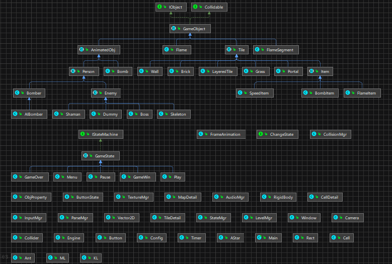

    <h1><b> Bomberman Game </b></h1>
    

## Modes
### Normal-play:
Use your keyboard and try to survive while exploring the maps.

### Autoplay:
Sit back and watch the AIBomber take over the game.
- A-star algorithm: helps the hero find the shortest path to defeat the nearest enemy or reach the portal.
- SMMAX: guides the hero towards their destination (either an enemy or the portal) when no path is found by the A-star algorithm.

## Instruction
- Direction: ↑, ↓, ←, →  
- Bomb: SPACE  

- ENTER: Move to next stage (after entering portal)  
- R: Play again (after entering portal)  
- ESC: Exit the game to the main menu

## Class diagram

## Contributors
- Bui Huu Viet Hung
- Nguyen Hai Phong
- Vu Ha Minh Trang
